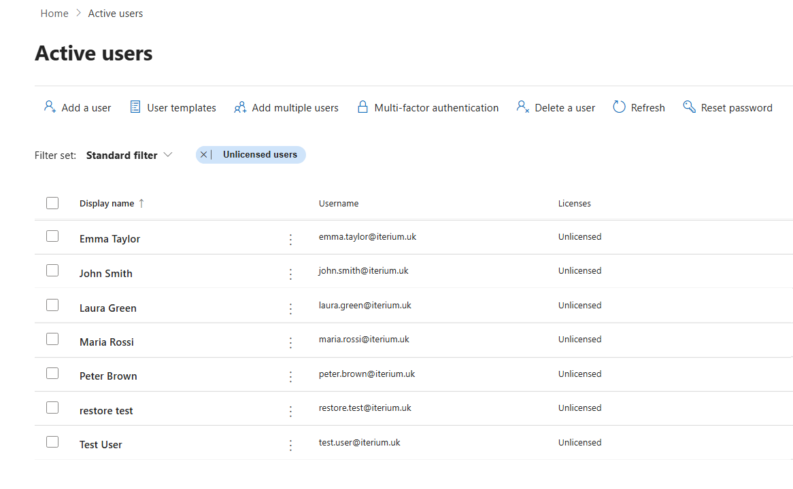
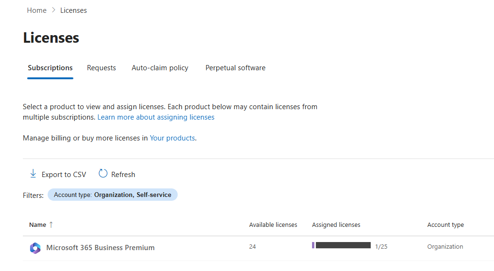
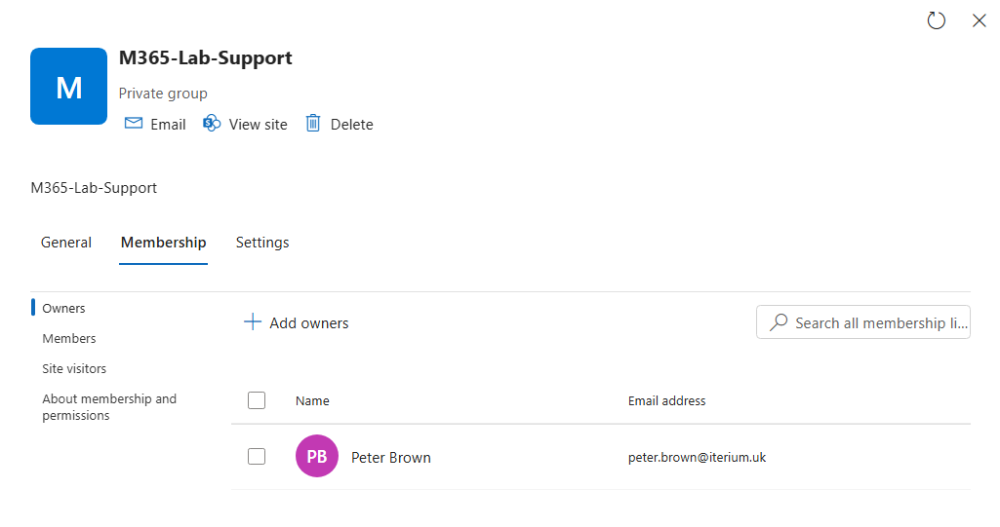
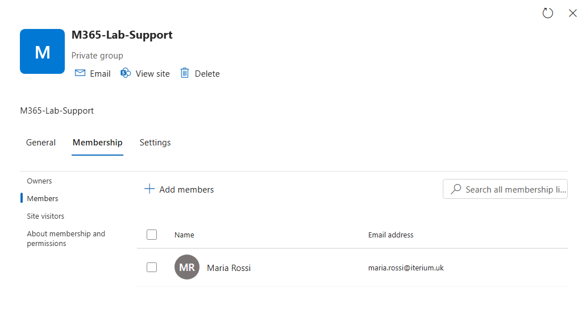

# Microsoft 365 User Lifecycle & Licensing

> Hands-on Microsoft 365 IT support case study covering user administration, licensing, account access, Microsoft 365 groups, Service Health, troubleshooting, and user recovery.

**Platform:** Microsoft 365 Business Premium  
**Custom domain:** `iterium.uk`  
**Focus:** IT Helpdesk / Desktop Support / Microsoft 365 Support

`Microsoft 365` `User Administration` `Licensing` `Account Support` `Service Health` `ITSM` `Troubleshooting` `Least Privilege`

---

## Project Overview

This case study documents a practical Microsoft 365 support environment created to simulate common Helpdesk and Desktop Support tasks.

The lab focused on administering fictional employee accounts and investigating user-access issues using a consistent support workflow.

**Support workflow:** Symptom → Scope → Identity → Account state → Licensing → Service status → Resolve or escalate → Verify → Document

All employee identities shown in this project are fictional and were created specifically for the lab.

---

## Environment at a Glance

| Component | Configuration |
|---|---|
| Platform | Microsoft 365 Business Premium |
| Custom domain | `iterium.uk` |
| Original tenant domain | `iteriumlab.onmicrosoft.com` |
| Business Premium licences | 25 |
| Assigned licences | 1 |
| Available licences | 24 |
| Email service | Exchange Online |
| Administration | Microsoft 365 Admin Center |
| Identity platform | Microsoft Entra ID |

A separate privileged administrator identity is retained for administrative and recovery purposes.

---

## User Administration

Fictional departmental accounts were created to provide a repeatable environment for user-management and troubleshooting exercises.

| User | Department | Initial licence state |
|---|---|---|
| Maria Rossi | Finance | Unlicensed |
| John Smith | Sales | Unlicensed |
| Laura Green | HR | Unlicensed |
| Peter Brown | IT | Unlicensed |
| Test User | Support Testing | Unlicensed |
| Emma Taylor | Operations | Unlicensed |

### Evidence

The lab included:

- User creation using the custom `iterium.uk` domain
- User attributes and usage location
- Password resets
- Block and restore sign-in
- Licence inspection
- Licensed vs unlicensed identity comparison
- Deleted-user recovery

---

## Identity and Licensing

A central support concept demonstrated in the lab is that a Microsoft 365 identity does not automatically provide access to licensed Microsoft 365 services.

A user can exist in the tenant and be permitted to sign in while having no Microsoft 365 Business Premium licence assigned.

### Business Premium Licence State

| Licence property | Result |
|---|---:|
| Business Premium licences | 25 |
| Assigned | 1 |
| Available | 24 |

Identity, product licensing, and administrative privilege were treated as separate areas during troubleshooting.

---

# Featured Support Case Study

## INC001 - New Starter Missing Microsoft 365 Licence

### Reported Problem

A newly created employee account existed in Microsoft 365, but the user did not have access to the licensed Microsoft 365 services expected for a normal employee.

**Impact:** Single user

### Investigation

The account was checked in the following order: identity, sign-in state, licence assignment, and tenant licence availability.

| Check | Result |
|---|---|
| User identity exists | Yes |
| Sign-in permitted | Yes |
| Business Premium assigned | No |
| Business Premium licences available | Yes |

### Root Cause

The user had a valid Microsoft 365 identity but no Microsoft 365 Business Premium licence assigned.

The account itself was functioning correctly. The missing product licence prevented entitlement to the expected licensed services.

### Recommended Resolution

If authorised to manage licence assignments:

1. Confirm Business Premium is appropriate for the employee.
2. Verify that a licence is available.
3. Assign the licence.
4. Allow the required services to provision.
5. Verify service access with the user.

If licence assignment requires additional approval or privileges, document the confirmed root cause and escalate through the appropriate organisational process.

### Lab Outcome

The account was intentionally retained in an unlicensed state for further troubleshooting exercises.

No working user's licence was removed or changed simply to complete the scenario.

[View the full INC001 incident report](incidents/INC001-missing-m365-license.md)

---

## Microsoft 365 Group Administration

A private Microsoft 365 group was created for the fictional support environment.

**Group:** `M365-Lab-Support`

| Role | User |
|---|---|
| Owner | Peter Brown |
| Member | Maria Rossi |

Microsoft Teams was not enabled for this group during the exercise.

### Group Owner

Peter Brown was configured as the group owner.

### Group Member

Maria Rossi was configured as a group member.

This exercise covered group creation, privacy settings, ownership, membership, and the distinction between a Microsoft 365 group and Teams enablement.

---

## Additional Support Exercises

<strong>Blocked sign-in troubleshooting</strong>

A test user was unable to sign in.

The identity existed normally, but account sign-in had been administratively blocked.

**Finding:** Sign-in blocked  
**Action:** Restored sign-in access  
**Verification:** Account returned to a permitted sign-in state

A password reset would not have resolved this issue because password state and sign-in state are separate.

<strong>Deleted user recovery</strong>

A temporary identity was deleted to reproduce an accidental employee-account deletion.

**Recovery path:** Active users → Deleted users → Locate original identity → Restore

The original identity was successfully restored rather than replaced with a new account.

This demonstrated why recently deleted accounts should be checked for recovery before creating replacement identities.

<strong>Microsoft 365 Service Health</strong>

Service Health was reviewed as part of multi-user incident triage.

| Scope | Initial approach |
|---|---|
| One user affected | Investigate user, account, device or application |
| Multiple users affected | Check Microsoft 365 Service Health early |

During the lab, active Microsoft advisories were reviewed and compared with the reported symptoms.

An advisory was treated as supporting evidence only when its affected service and symptoms matched the issue being investigated.

**Key principle:** Service Health is evidence, not an automatic diagnosis.

<strong>Administrative roles and least privilege</strong>

The following administrative roles were reviewed:

| Role | General purpose |
|---|---|
| Global Administrator | Broad tenant-wide administration |
| User Administrator | User-management capabilities |
| Helpdesk Administrator | Common user-support operations |
| License Administrator | Product licence-management operations |

The exercise reinforced the principle of least privilege.

Administrative permissions should match job responsibilities rather than granting broad access by default.

A first-line Service Desk technician performing routine account-support tasks should not automatically receive Global Administrator privileges.

---

## Support Principles Applied

- Establish the exact symptom before assuming a cause.
- Determine whether one or multiple users are affected.
- Verify identity and account state before making changes.
- Check licence entitlement when Microsoft 365 services are unavailable.
- Check Service Health early for wider cloud-service issues.
- Avoid repeating remediation without evidence.
- Apply least privilege to administrative access.
- Escalate work that exceeds scope, permissions, or acceptable risk.
- Verify the resulting state after remediation.
- Record confirmed findings rather than assumptions in ITSM documentation.

---

## Skills Demonstrated

| Area | Practical Skills |
|---|---|
| Microsoft 365 | Admin Center navigation and tenant administration |
| Identity | User creation and account-state inspection |
| Licensing | Business Premium availability and assignment diagnosis |
| Account Support | Password reset and block/unblock sign-in |
| Recovery | Deleted-user restoration |
| Groups | Microsoft 365 group ownership and membership |
| Administration | Role awareness and least privilege |
| Service Monitoring | Microsoft 365 Service Health |
| Troubleshooting | Scope, diagnosis and root-cause identification |
| ITSM | Evidence-based incident documentation |
| Escalation | Permission, scope and risk awareness |

---

## Technical Documentation

Detailed technical notes:

[Microsoft 365 Tenant, Users & Licensing - Technical Notes](notes/01-m365-tenant-users-licensing.md)

Full support incident:

[INC001 - New Starter Missing Microsoft 365 Licence](incidents/INC001-missing-m365-license.md)

---

## Project Context

This case study is part of a broader hands-on Microsoft IT Support lab.

Additional case studies will document Microsoft Entra ID, authentication troubleshooting, Microsoft Teams, SharePoint, Windows endpoints, Intune, Conditional Access, and Active Directory as those practical labs are completed.